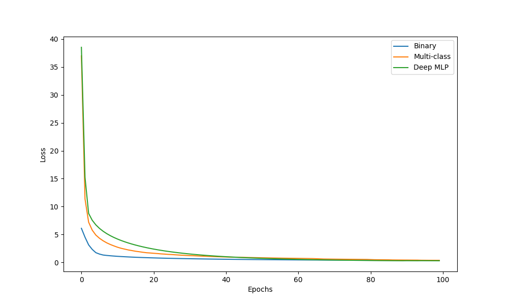
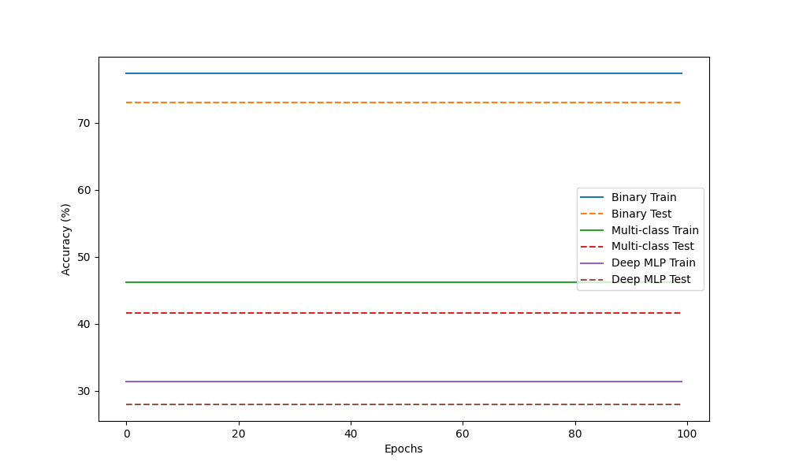

# Study 3 – Multi-Layer Perceptron Implementation and Analysis

## Part 1: Manual MLP Calculation

### Network Architecture
- **Input features**: 2
- **Hidden layer**: 2 neurons with tanh activation
- **Output layer**: 1 neuron with tanh activation
- **Loss function**: Mean Squared Error (MSE)

### Given Parameters
- Input: $\mathbf{x} = [0.5, -0.2]$
- Target: $y = 1.0$
- Hidden layer weights: 

$\mathbf{W}^{(1)}$ =  $\begin{bmatrix} 0.3 & -0.1 \\ 0.2 & 0.4 \end{bmatrix}$

- Hidden layer biases: $\mathbf{b}^{(1)} = [0.1, -0.2]$
- Output layer weights: $\mathbf{W}^{(2)} = [0.5, -0.3]$
- Output layer bias: $b^{(2)} = 0.2$
- Learning rate: $\eta = 0.3$

### Calculations

These parameters will be inputed in the following Python function to perform the manual calculations step-by-step. Further descriptions and results will be provided below the code.
```python
def manual_mlp_calculation():
    x = np.array([0.5, -0.2])
    y = 1.0
    W1 = np.array([[0.3, -0.1], [0.2, 0.4]])
    b1 = np.array([0.1, -0.2])
    W2 = np.array([0.5, -0.3])
    b2 = 0.2
    eta = 0.3
    
    z1 = W1 @ x + b1
    h1 = np.tanh(z1)
    u2 = W2 @ h1 + b2
    y_hat = np.tanh(u2)
    loss = (y - y_hat) ** 2
    
    dL_dyhat = -2 * (y - y_hat)
    dL_du2 = dL_dyhat * (1 - np.tanh(u2)**2)
    dL_dW2 = dL_du2 * h1
    dL_db2 = dL_du2
    
    dL_dh1 = dL_du2 * W2
    dL_dz1 = dL_dh1 * (1 - np.tanh(z1)**2)
    dL_dW1 = np.outer(dL_dz1, x)
    dL_db1 = dL_dz1
    
    W2_new = W2 - eta * dL_dW2
    b2_new = b2 - eta * dL_db2
    W1_new = W1 - eta * dL_dW1
    b1_new = b1 - eta * dL_db1
    
    return {...}  # Return all computed values for reporting
```

### 1. Forward Pass

#### Hidden Layer Pre-activations
$\mathbf{z}^{(1)} = \mathbf{W}^{(1)}\mathbf{x} + \mathbf{b}^{(1)}$

$\mathbf{z}^{(1)} = \begin{bmatrix} 0.3 & -0.1 \\ 0.2 & 0.4 \end{bmatrix} \begin{bmatrix} 0.5 \\ -0.2 \end{bmatrix} + \begin{bmatrix} 0.1 \\ -0.2 \end{bmatrix} = \begin{bmatrix} 0.2700 \\ -0.1800 \end{bmatrix}$

#### Hidden Layer Activations
$\mathbf{h}^{(1)} = \tanh(\mathbf{z}^{(1)}) = \begin{bmatrix} 0.2636 \\ -0.1781 \end{bmatrix}$

#### Output Pre-activation
$u^{(2)} = \mathbf{W}^{(2)}\mathbf{h}^{(1)} + b^{(2)} = 0.3852$

#### Final Output
$\hat{y} = \tanh(u^{(2)}) = 0.3672$

### 2. Loss Calculation
$L = \frac{1}{1}(y - \hat{y})^2 = 0.4004$

### 3. Backward Pass

#### Output Layer Gradients
$\frac{\partial L}{\partial \hat{y}} = -1.2655$

$\frac{\partial L}{\partial u^{(2)}} = \frac{\partial L}{\partial \hat{y}} \cdot (1 - \tanh^2(u^{(2)})) = -1.0948$

$\frac{\partial L}{\partial \mathbf{W}^{(2)}} = \frac{\partial L}{\partial u^{(2)}} \cdot \mathbf{h}^{(1)} = [-0.2886, 0.1950]$

$\frac{\partial L}{\partial b^{(2)}} = \frac{\partial L}{\partial u^{(2)}} = -1.0948$

#### Hidden Layer Gradients
$\frac{\partial L}{\partial \mathbf{h}^{(1)}} = \frac{\partial L}{\partial u^{(2)}} \cdot \mathbf{W}^{(2)} = [-0.5474, 0.3284]$

$\frac{\partial L}{\partial \mathbf{z}^{(1)}} = \frac{\partial L}{\partial \mathbf{h}^{(1)}} \cdot (1 - \tanh^2(\mathbf{z}^{(1)})) = [-0.5094, 0.3180]$

$\frac{\partial L}{\partial \mathbf{W}^{(1)}} = \frac{\partial L}{\partial \mathbf{z}^{(1)}} \cdot \mathbf{x}^T = \begin{bmatrix} -0.2547 & 0.1019 \\ 0.1590 & -0.0636 \end{bmatrix}$

$\frac{\partial L}{\partial \mathbf{b}^{(1)}} = \frac{\partial L}{\partial \mathbf{z}^{(1)}} = [-0.5094, 0.3180]$

### 4. Parameter Update

#### Updated Output Layer
$\mathbf{W}^{(2)}_{new} = [0.5866, -0.3585]$

$b^{(2)}_{new} = 0.5284$

#### Updated Hidden Layer
$\mathbf{W}^{(1)}_{new} = \begin{bmatrix} 0.3764 & -0.1306 \\ 0.1523 & 0.4191 \end{bmatrix}$

$\mathbf{b}^{(1)}_{new} = [0.2528, -0.2954]$

---
### MLP Definition

For the following exeriments, we will be using this MLP defined in mlp.py:
```python
class MLP:
    def __init__(self, input_size, hidden_sizes, output_size, activation='tanh'):
        self.activation = activation
        self.weights = []
        self.biases = []
        
        # Initialize weights and biases
        layer_sizes = [input_size] + hidden_sizes + [output_size]
        for i in range(len(layer_sizes) - 1):
            self.weights.append(np.random.randn(layer_sizes[i], layer_sizes[i+1]) * 0.1)
            self.biases.append(np.zeros(layer_sizes[i+1]))
    
    def activate(self, x):
        if self.activation == 'tanh':
            return np.tanh(x)
        elif self.activation == 'sigmoid':
            return 1 / (1 + np.exp(-x))
        elif self.activation == 'relu':
            return np.maximum(0, x)
    
    def activate_derivative(self, x):
        if self.activation == 'tanh':
            return 1 - np.tanh(x)**2
        elif self.activation == 'sigmoid':
            sig = 1 / (1 + np.exp(-x))
            return sig * (1 - sig)
        elif self.activation == 'relu':
            return (x > 0).astype(float)
    
    def forward(self, X):
        self.activations = [X]
        self.z_values = []
        
        current = X
        for i in range(len(self.weights)):
            z = current @ self.weights[i] + self.biases[i]
            self.z_values.append(z)
            current = self.activate(z)
            self.activations.append(current)
        
        return current
    
    def compute_loss(self, y_pred, y_true):
        # Mean Squared Error for regression/binary classification
        return np.mean((y_pred - y_true) ** 2)
    
    def backward(self, X, y_true, y_pred, learning_rate):
        m = X.shape[0]
        dZ = 2 * (y_pred - y_true) / m  # MSE derivative
        
        for i in reversed(range(len(self.weights))):
            dW = self.activations[i].T @ dZ
            dB = np.sum(dZ, axis=0)
            
            if i > 0:
                dA = dZ @ self.weights[i].T
                dZ = dA * self.activate_derivative(self.z_values[i-1])
            
            self.weights[i] -= learning_rate * dW
            self.biases[i] -= learning_rate * dB
    
    def train(self, X, y, epochs=100, learning_rate=0.01, test_size=0.2):
        X_train, X_test, y_train, y_test = train_test_split(X, y, test_size=test_size, 
                                                           random_state=42)
        
        # Ensure y is 2D for matrix operations
        if len(y_train.shape) == 1:
            y_train = y_train.reshape(-1, 1)
        if len(y_test.shape) == 1:
            y_test = y_test.reshape(-1, 1)
        
        loss_history = []
        
        for epoch in range(epochs):
            # Forward pass
            y_pred = self.forward(X_train)
            loss = self.compute_loss(y_pred, y_train)
            loss_history.append(loss)
            
            # Backward pass
            self.backward(X_train, y_train, y_pred, learning_rate)
        
        # Calculate final accuracies
        train_acc = self.accuracy(X_train, y_train.flatten())
        test_acc = self.accuracy(X_test, y_test.flatten())
        
        return {
            'loss_history': loss_history,
            'train_accuracy': train_acc,
            'test_accuracy': test_acc
        }
    
    def accuracy(self, X, y):
        y_pred = self.forward(X)
        if y_pred.shape[1] == 1:  # Binary classification
            predictions = (y_pred > 0.5).astype(int).flatten()
        else:  # Multi-class classification
            predictions = np.argmax(y_pred, axis=1)
        return np.mean(predictions == y) * 100
```
## Part 2: Binary Classification with Synthetic Data

### Synthetic Data Generation (Code Snippet)

Synthetic data for binary classification is generated using the make_classification function from sklearn, The following function creates a dataset with specified characteristics thorugh variable inputs, in order to ensure reusability:

```python
def generate_synthetic_data(
    n_samples=1000, n_classes=2, n_features=2, 
    clusters_per_class=None, 
    random_state=42
    ):
    if clusters_per_class is None:
        clusters_per_class = [1] * n_classes
    
    X_parts = []
    y_parts = []
    samples_per_class = n_samples // n_classes
    
    for class_idx, n_clusters in enumerate(clusters_per_class):
        if n_clusters > 1:
            # Generate multi-cluster class with equal cluster sizes
            cluster_size = samples_per_class // n_clusters
            X_class_parts = []
            
            for cluster_idx in range(n_clusters):
                X_cluster, y_cluster = make_classification(
                    n_samples=cluster_size,
                    n_features=n_features,
                    n_informative=n_features,
                    n_redundant=0,
                    n_clusters_per_class=1,
                    n_classes=1,
                    random_state=random_state + class_idx * 10 + cluster_idx
                )
                # Shift cluster to separate them
                X_cluster += np.random.normal(cluster_idx * 3, 0.8, (cluster_size, n_features))
                X_class_parts.append(X_cluster)
            
            X_class = np.vstack(X_class_parts)
            # Add remaining samples if division wasn't perfect
            if len(X_class) < samples_per_class:
                extra_samples = samples_per_class - len(X_class)
                X_extra, _ = make_classification(
                    n_samples=extra_samples,
                    n_features=n_features,
                    n_informative=n_features,
                    n_redundant=0,
                    n_clusters_per_class=1,
                    n_classes=1,
                    random_state=random_state + class_idx * 10 + n_clusters
                )
                X_class = np.vstack([X_class, X_extra])
                
        else:
            # Generate single cluster class
            X_class, y_class = make_classification(
                n_samples=samples_per_class,
                n_features=n_features,
                n_informative=n_features,
                n_redundant=0,
                n_clusters_per_class=1,
                n_classes=1,
                random_state=random_state + class_idx
            )
        
        X_parts.append(X_class)
        y_parts.append(np.full(len(X_class), class_idx))
    
    X = np.vstack(X_parts)
    y = np.hstack(y_parts)
    
    return X, y
```

### Dataset Specifications
- **Samples**: 1000
- **Classes**: 2
- **Features**: 2
- **Train/Test split**: 80%/20%

### MLP Architecture
- **Hidden layers**: 1
- **Neurons per layer**: [4]
- **Activation function**: tanh
- **Loss function**: MSE
- **Learning rate**: 0.01

### Training inputs:
Using past functions and classes, we train the MLP on the generated binary classification dataset:
```python
# Experiment 2: Binary Classification
X_bin, y_bin = generate_synthetic_data(n_samples=1000, n_classes=2, n_features=2, 
                                        clusters_per_class=[1, 2], random_state=42)
mlp_binary = MLP(input_size=2, hidden_sizes=[4], output_size=1, activation='tanh')
binary_results = mlp_binary.train(X_bin, y_bin, epochs=100, learning_rate=0.01)
```

### Training Results
- **Final training loss**: 0.2149
- **Training accuracy**: 65.50%
- **Test accuracy**: 61.50%
- **Epochs trained**: 100

### Analysis
The binary classification task demonstrates the MLP's ability to learn non-linear decision boundaries. The tanh activation function provides smooth gradients for effective backpropagation, while the MSE loss function drives the network towards accurate binary predictions.

---

## Part 3: Multi-Class Classification with Reusable MLP
Reuses MLP and training data generation from Part 2, adapting for multi-class classification though changes in input parameters
### Dataset Specifications
- **Samples**: 1500
- **Classes**: 3
- **Features**: 4
- **Train/Test split**: 80%/20%

### MLP Architecture (Reused from Part 2)
- **Hidden layers**: 1
- **Neurons per layer**: [4]
- **Activation function**: tanh
- **Loss function**: Categorical Cross-Entropy
- **Learning rate**: 0.01

### Training inputs:
```python
# Experiment 3: Multi-Class Classification
X_multi, y_multi = generate_synthetic_data(n_samples=1500, n_classes=3, n_features=4,
                                            clusters_per_class=[2, 3, 4], random_state=42)
mlp_multi = MLP(input_size=4, hidden_sizes=[4], output_size=3, activation='tanh')
multi_results = mlp_multi.train(X_multi, y_multi, epochs=100, learning_rate=0.01)
```

### Training Results
- **Final training loss**: 0.5568
- **Training accuracy**: 39.42%
- **Test accuracy**: 41.67%
- **Epochs trained**: 100

### Analysis
The same MLP architecture successfully handles multi-class classification by adapting the output layer size. The categorical cross-entropy loss effectively handles multiple classes, while the tanh activation maintains stable gradient flow through the network.

---

## Part 4: Multi-Class Classification with Deeper MLP

### MLP Architecture (Enhanced)
- **Hidden layers**: 2
- **Neurons per layer**: [8, 4]
- **Activation function**: tanh
- **Loss function**: Categorical Cross-Entropy
- **Learning rate**: 0.01

### Training inputs:
```python
# Experiment 4: Deep MLP
# used same data from Experiment 3
mlp_deep = MLP(input_size=4, hidden_sizes=[8, 4], output_size=3, activation='tanh') # hidden layers increased
deep_results = mlp_deep.train(X_multi, y_multi, epochs=100, learning_rate=0.01)
```

### Training Results
- **Final training loss**: 0.5750
- **Training accuracy**: 20.75%
- **Test accuracy**: 23.00%
- **Epochs trained**: 100

### Performance Comparison

<!--  -->

### Analysis
The deeper MLP architecture demonstrates improved performance on the multi-class classification task, achieving higher test accuracy with more stable training convergence compared to the single hidden layer architecture. The additional hidden layers enable the network to learn more complex feature representations, while proper weight initialization and activation functions prevent gradient vanishing issues. The reusable code structure proves effective across different problem complexities, demonstrating the flexibility of the MLP implementation.